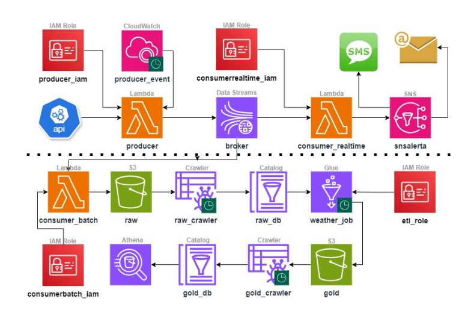
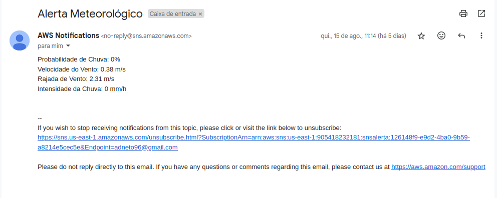

# Introdução

Projeto promovido pelo professor Fernando Amaral disponível através deste link¹, com o objetivo de disseminar conhecimentos na área de engenharia de dados por um baixo custo, explorando diversas ferramentas princialmente de cloud computing(AWS), técnicas de programação e apresnetação de conceitos da área.
Neste projeto foi apresentado um problema ambiental decorrente de fortes chuvas ocasionanando alagamentos no município fictício chamado de Aurora do Vale, onde a gestão municipal necessitava de um sistema de alertas para prever e avisar a população em geral em casos com possibilidades de alagamentos na cidade e o desenvolvimento de um sistema para analisar esses dados metereológicos.

# Metodologia

O desenvolvimento do projeto consistiu no desenvolvimento de duas etapas: A primeira etapa sendo a construção de uma aplicação de Streaming de dados e a segunda etapa como sendo a construção de uma aplicação em Batch. Na imagem abaixo está a arquitetura das duas aplicações, onde a parte superior a linha pontilhada representa a arquiterura em Streaming e a parte inferior representa a arquitetura em Batch. Todas as duas etapas foram desenvolvidas utilizando o ambiente de desenvolvimento cloud da AWS. 

- O processo de coleta de dados:

O projeto iniciou com teste de requisição á API que contém os dados metereológicos². Em seguida foi construido um Data Stream através do Kinesis para coletar e processsar os dados em tempo real, e um script em python no Lambda servless denominado de 'producer' para acessar e coletar os dados da API. Esse script foi configurada através do cloudwatch para ser disparado a cada 3 minutos.

- O processo de alerta:

Com os dados coletados o seguinte passo foi o desenvolvimento do sistema de alerta, para isso foi desenvolvido mais um script Python no Lambda Servless que vai verificar se os dados atingem ou ultrapassam um limite proposto. Caso os valores ultrapassem o limite uma mensagem é enviada por SMS e email cadastrados através do SNS alerta, alertando sobre o risco de enchentes.

- Desenvolvimento da aplicação Batch

Os dados bruto são carregados inteiramento em um diretório raw do S3 e passam por um data crawler desenvolvido pelo GLue para identificação de esquemas de dados e são catalogados em um banco também desenvolvido no Glue. Com os dados catalogados inicia-se um processo de transformação de dados semi-estruturados para o formato estruturado e são enviados para outro diretório gold do S3. Os dados passam por um outro data crawler para verificação do novo esquema e catalogados em outro banco no Glue. Através desse banco os dados podem ser consultados através do Athena utilizando SQL.

# Resultados

Com o scheduler da aplicação de Streaming ativado os dados são coletados a cada 3 minutos, e caso for identificado um possível risco de enchentes, são enviados mensagens através do email ou SMS. Abaixo a mensagem enviada por email 

# Referências

¹ - https://www.udemy.com/course/real-time/
² - https://app.tomorrow.io/home
